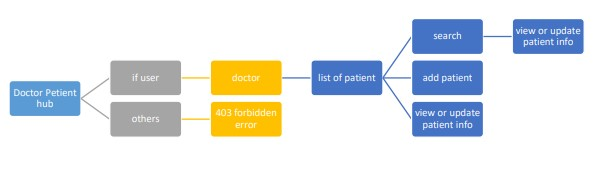
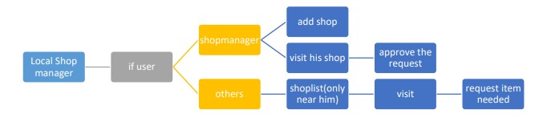
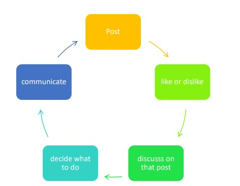

# CovidSuraksha

This website has **5 features** those are:

1. Doctor Patient HUB
1. Local Shop Manager
1. Community
    1. Global Community
    1. Lock down stuck Community
    1. Quarentine Community

---

### Doctor patient HUB

As we know there is no particular medicine for Covid-19 so we decide that if we store all the data of each patient it will help other doctor to find the best medicine works for the patient.

###### How it works:

A doctor register by providing basic details and he will get the permmission to enter here. Only a doctor can create a patient with details and then can update the condition by submiting a form it will store in a database. There is a search field where another doctor can search by the conditon or medicine name etc. and all patient profile corresponding search data will provide there

### Local Shop Manager

In this pandemic situation we have to aware of social distance but we need our daily essentials. we have to go to shop but we have to aoid crowd. So we decided that if we use online service like ecommerce website instade of using delivery boy if we go when the shopmanager appoint us then we can avoid crowd and we will get our needs.

###### How it works:

there are two type of user

-   shop manager
-   User

for shop manager they can add there shop by clicking a add shop button and provide the basic details. details will store in our database and the owner can see his/her shop in home section. **the owner can see how many pending request in the visit button so he can easily find how many request to handel**
he visit and approve the pending request and provide some notes if he want

for user in home section the user can see only the shop in his district. he can search which shop he want and then he can visit and request the item(s) he want. and after shop owner approval he can see the the appoinment details.

### Community

we are at home and as a human we have to communicate and we have a learge number of social media service **Then why we need the community app?**

-   User can update his thoughts here about this situation and it will not lost in meme
-   a lock down stuck people need food he can request there and the local ngo or club will help him
-   a Qurentine patient update his status and doctor can help him out.
-   anyone who need medical help doctor or the user who is in medical field will help him.
    and we know the user will find more great way to use it.

### Software and Hardware Needed

* hardware a pc or a mobile and a active internet connection
* software a web browser

#### The process and data flow diagram

#### Using this website

You can visit website https://covidsuraksha.pythonanywhere.com

For coder:

    	open the terminal in the project folder and create an python enviorement
        and then type
      pip install -r requiements.txt
      python manage.py makemigrations accounts patientinfo shopmanager community
      python manage.py migrate

then you can run the server using
python manage.py runserver
now you can checkout our website..

###### \*\* for any help visit django documentation
